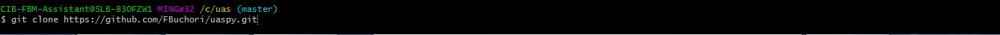
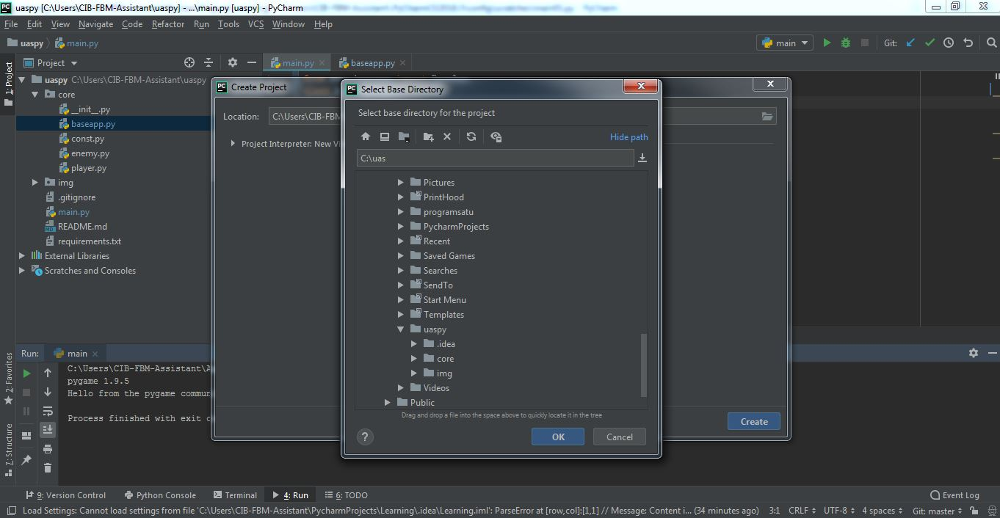
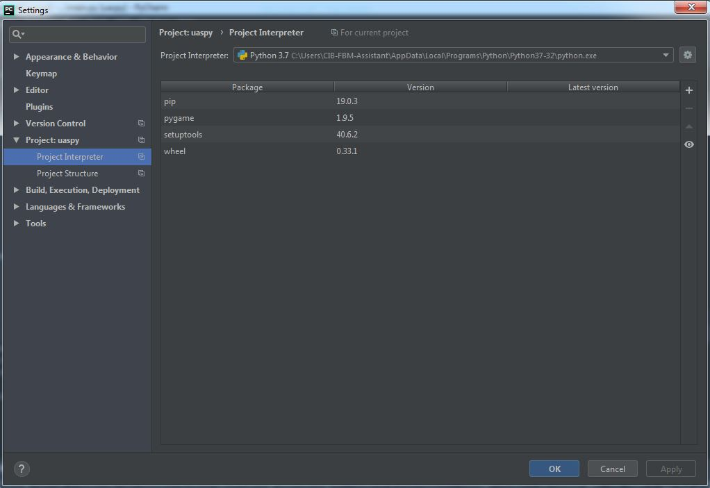
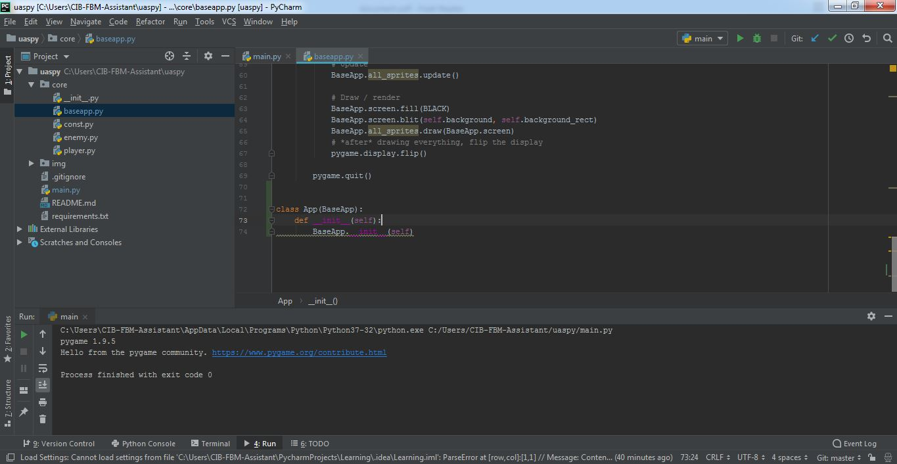
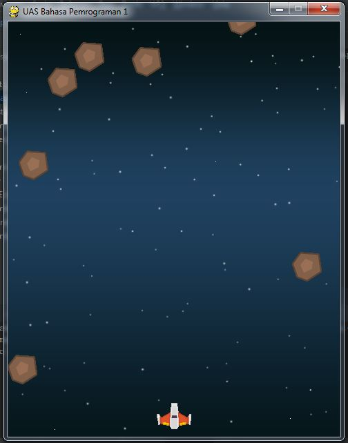

# uas
# UAS

* 1. Lakukan Fork dari repository berikut: 
https://github.com/abuazzam/uaspy, kemudian 
Clone *
#

* 2. Lakukan konfigurasi virtual environment pada project anda*
#

* 3. Install requirements yang dibutuhkan (pip install atau dari 
PyCharm).*
#

* 4.Buat class utama dengan menurunkan dari class BaseApp dengan nama 
App (seusikan kode
program pada main.py)*
#

* 5.Jalankan aplikasi sehingga muncul tampilan seperti berikut:*
#

